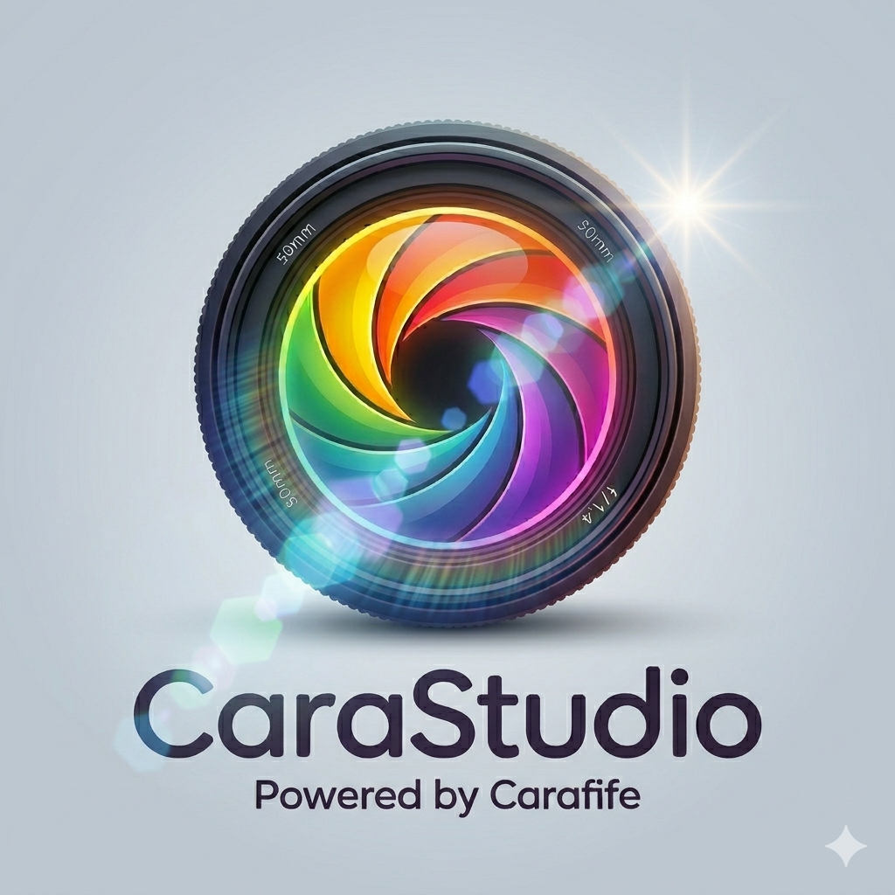

# CaraStudio

**CaraStudio** est un convertisseur RAW open-source pour Linux, fork de [RawStudio](https://github.com/rawstudio/rawstudio), développé et maintenu par [Carafife](https://github.com/carafife).

CaraStudio permet de lire, ajuster et convertir les fichiers RAW de votre appareil photo numérique en JPEG, PNG ou TIFF, avec une interface sombre professionnelle inspirée des logiciels de retouche modernes.

---

## Fonctionnalités

- Interface GTK3 sombre et ergonomique
- Support complet des profils couleur DNG (Color Profile)
- Traitement par lot
- Prise de vue en direct (tethered shooting)
- Réglages post-capture : balance des blancs, saturation, exposition, courbes…
- Copier/coller les réglages entre images
- Correction automatique de la distorsion (Lensfun)
- Réduction du bruit avancée
- Correction des aberrations chromatiques et du vignettage
- Masque d'exposition, recadrage, redressement
- Mode plein écran et support multi-moniteur
- Traitement multithread optimisé SSE/SSE2
- Nommage automatique des fichiers basé sur les données EXIF

---

## Construction sur Fedora

### Dépendances

```bash
sudo dnf install gcc g++ autoconf automake libtool make gettext \
    gtk3-devel glib2-devel libxml2-devel sqlite-devel \
    lensfun-devel lcms2-devel libgphoto2-devel exiv2-devel \
    libjpeg-turbo-devel libtiff-devel fftw-devel libasan
```

### Compiler et installer (préfixe local)

```bash
./autogen.sh --prefix=/tmp/casan \
    CFLAGS="-fsanitize=address -g -O1 -fno-omit-frame-pointer" \
    CXXFLAGS="-fsanitize=address -g -O1 -fno-omit-frame-pointer" \
    LDFLAGS="-fsanitize=address"
make -j$(nproc)
make install
```

### Lancer

```bash
LD_LIBRARY_PATH=/tmp/casan/lib ASAN_OPTIONS="detect_leaks=0" /tmp/casan/bin/carastudio
```

---

## À propos du fork

CaraStudio est un fork de RawStudio (© Anders Brander, Anders Kvist, Klaus Post), distribué sous licence **GNU GPL v2 ou ultérieure**.

Les modifications apportées par Carafife incluent notamment :
- Portage et corrections pour Fedora 44 / Wayland / GTK3
- Thème sombre professionnel
- Corrections de crashes (use-after-free DCP, ROI hors limites)
- Amélioration du navigateur et du zoom
- Renommage et rebranding CaraStudio
